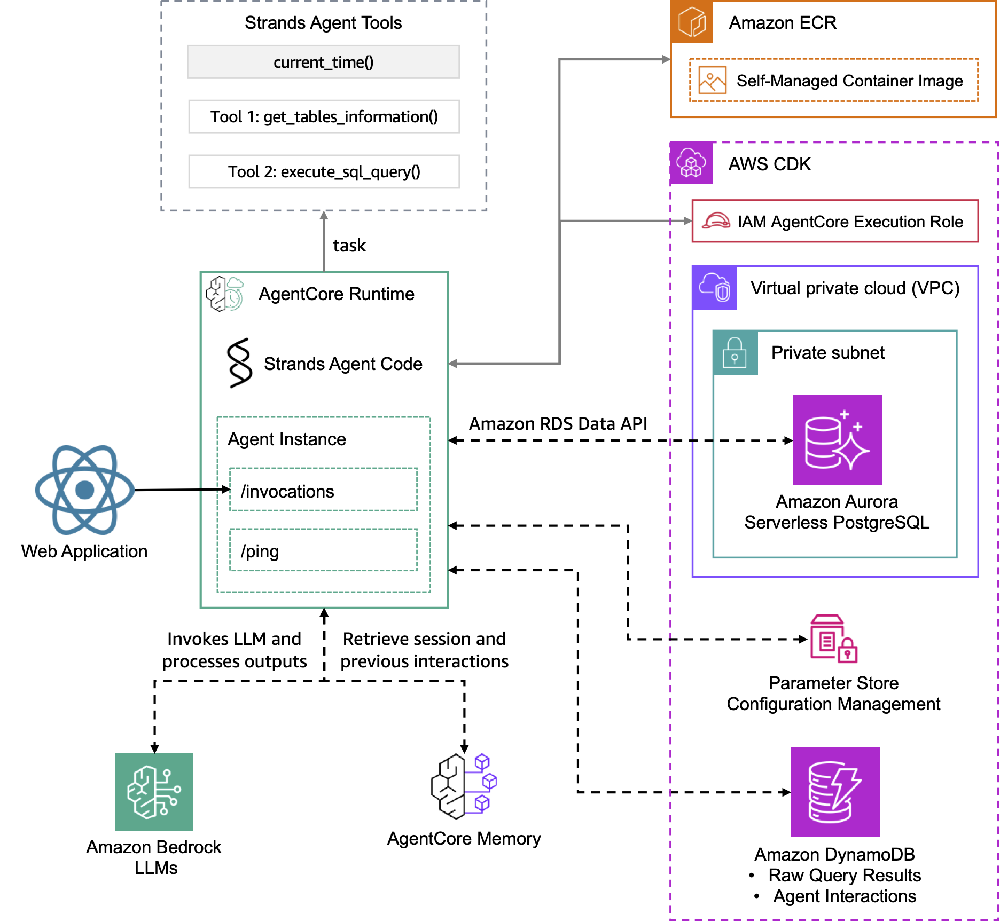
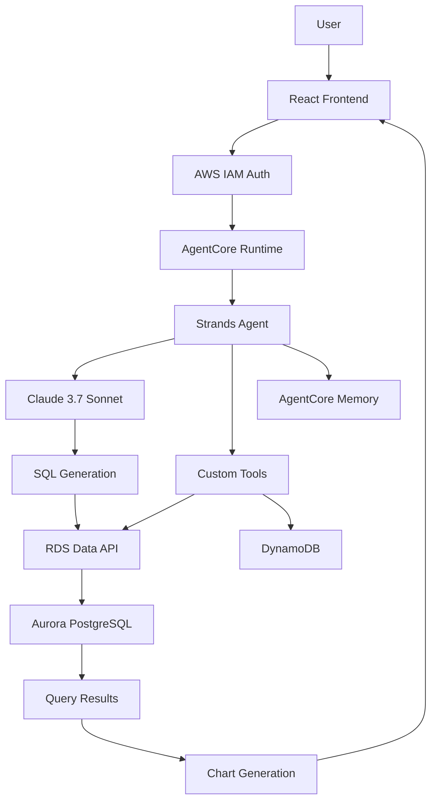
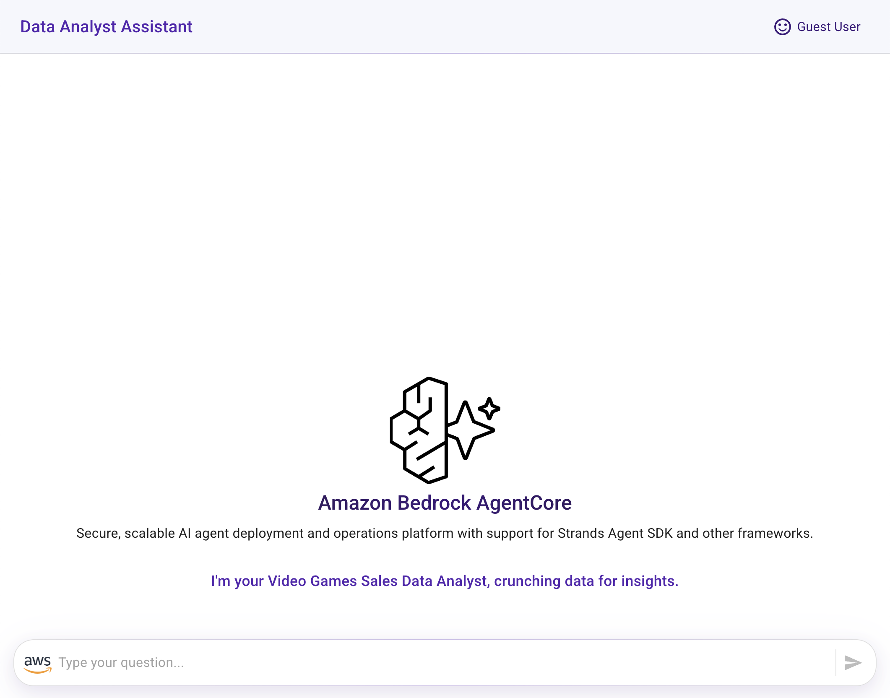
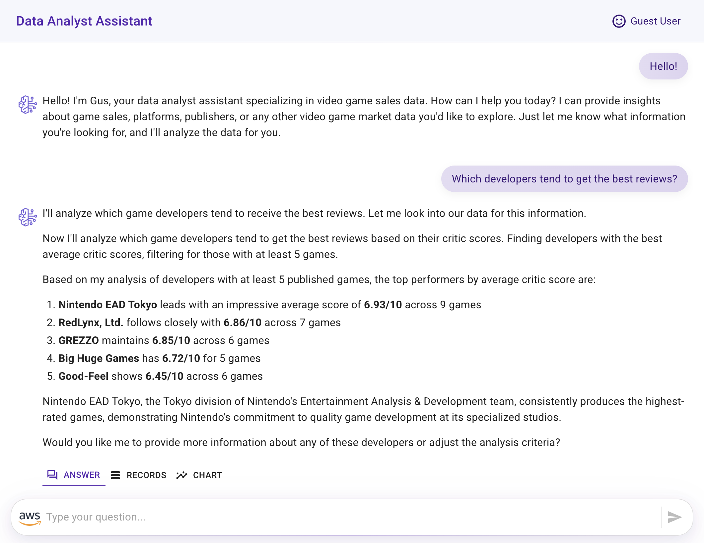
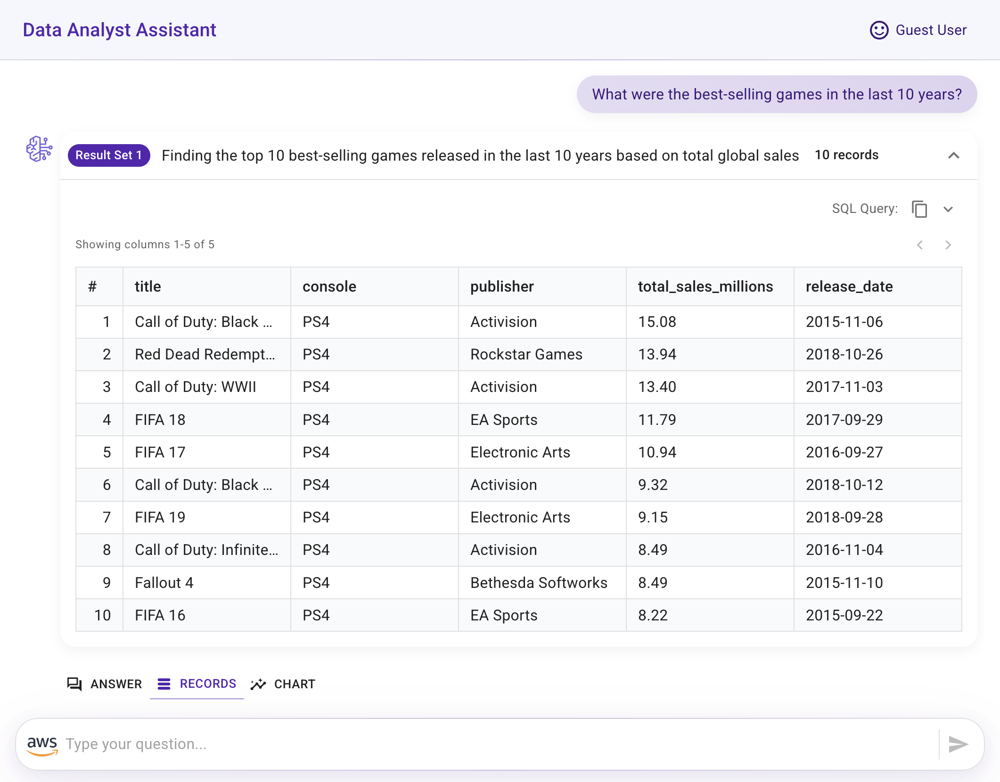
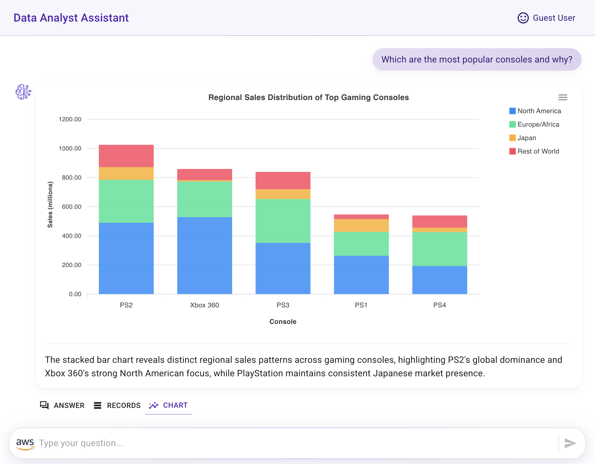
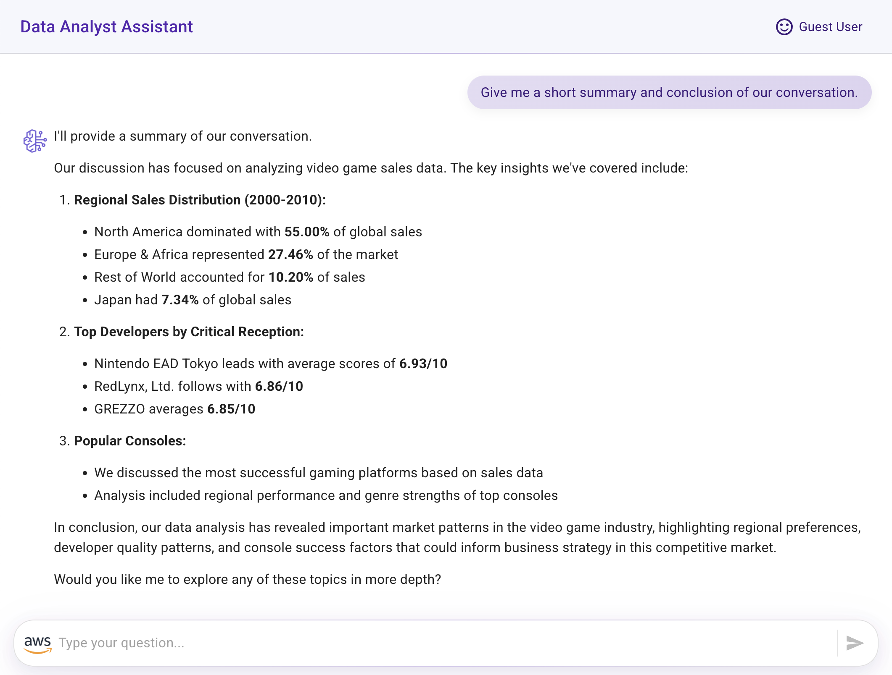

# Video Game Sales Assistant - Conversational Data Analyst Solution

> A complete end-to-end intelligent data analysis platform powered by Amazon Bedrock AgentCore and Strands Agents SDK

<div align="center">

</div>

## 📋 Project Summary

This comprehensive solution demonstrates a production-ready **Conversational Data Analyst Assistant** that transforms how organizations interact with their data. Instead of requiring SQL expertise or complex dashboard navigation, users can simply ask questions in natural language and receive intelligent analysis backed by real data.

The project showcases modern cloud-native architecture using **AWS Bedrock AgentCore** for scalable AI agent deployment, **Strands Agents SDK** for intelligent conversation handling, and a **React-based frontend** for seamless user interaction.

### 🎯 Key Capabilities

🤖 **Natural Language Data Querying**: Ask business questions in plain English  
📊 **Real-time SQL Generation**: AI automatically converts questions to optimized PostgreSQL queries  
📈 **Dynamic Visualizations**: Auto-generated charts and graphs from query results  
💾 **Persistent Memory**: Conversation context maintained across sessions  
🔒 **Enterprise Security**: Full AWS IAM integration with VPC isolation  
⚡ **Serverless Scale**: Aurora Serverless and AgentCore handle traffic spikes automatically  

### 🏢 Business Use Cases

- **Executive Dashboards**: C-level executives get instant answers to strategic questions
- **Business Intelligence**: Analysts explore data without SQL knowledge
- **Data Monetization**: Customer behavior insights and audience segmentation
- **Performance Optimization**: Infrastructure and operational analytics

## 🌳 Project Structure & Architecture

```
video-games-sales-assistant/
│
├── 📁 agentcore-strands-data-analyst-assistant/     # 🤖 AI Agent Core
│   ├── app.py                                       # Main agent application with streaming
│   ├── instructions.txt                             # AI agent behavior configuration
│   ├── requirements.txt                             # Python dependencies
│   ├── tables_information.txt                       # Database schema documentation
│   │
│   ├── 📁 src/                                      # Core agent functionality
│   │   ├── MemoryHookProvider.py                   # AgentCore memory integration
│   │   ├── rds_data_api_utils.py                   # PostgreSQL query execution
│   │   ├── ssm_utils.py                            # AWS Parameter Store access
│   │   ├── tools.py                                # Custom agent tools (DB schema, etc.)
│   │   └── utils.py                                # DynamoDB logging & session management
│   │
│   └── 📁 resources/                               # Supporting utilities
│       └── memory_manager.py                       # Memory lifecycle management
│
├── 📁 cdk-agentcore-strands-data-analyst-assistant/ # ☁️ Infrastructure as Code
│   ├── bin/cdk-agentcore-strands-data-analyst-assistant.ts  # CDK app entry point
│   ├── lib/cdk-agentcore-strands-data-analyst-assistant.ts  # Infrastructure definition
│   ├── cdk.json                                    # CDK configuration
│   ├── package.json                                # Node.js dependencies
│   │
│   ├── 📁 resources/                               # Database setup
│   │   ├── create-sales-database.py                # Data population script
│   │   └── 📁 database/
│   │       └── video_games_sales_no_headers.csv    # Sample dataset
│   │
│   └── 📁 test/                                    # Infrastructure tests
│       └── cdk-data-analyst-assistant.test.ts      # CDK stack validation
│
├── 📁 amplify-video-games-sales-assistant-agentcore-strands/ # 🌐 Web Frontend
│   ├── package.json                                # React app dependencies
│   ├── 📁 public/                                  # Static assets
│   │   ├── index.html                              # Main HTML template
│   │   ├── favicon.ico                             # App icon
│   │   └── 📁 images/                              # Branding assets
│   │       ├── agentcore.png                       # AgentCore logo
│   │       ├── AWS_logo_RGB.png                    # AWS branding
│   │       └── gen-ai-assistant-diagram.png        # Architecture diagram
│   │
│   ├── 📁 src/                                     # React application source
│   │   ├── App.js                                  # Main application component
│   │   ├── App.css                                 # Global styles
│   │   ├── index.js                                # React entry point
│   │   │
│   │   ├── 📁 components/                          # UI Components
│   │   │   ├── Chat.js                             # Conversation interface
│   │   │   ├── Answering.js                        # Response loading states
│   │   │   ├── LayoutApp.js                        # Application layout
│   │   │   ├── MarkdownRenderer.js                 # AI response formatting
│   │   │   ├── MyChart.js                          # Data visualization engine
│   │   │   ├── QueryResultsDisplay.js              # Raw data presentation
│   │   │   └── TableView.js                        # Tabular data display
│   │   │
│   │   └── 📁 utils/                               # Frontend utilities
│   │       ├── AwsAuth.js                          # AWS SDK authentication
│   │       ├── AwsCalls.js                         # AgentCore API integration
│   │       └── Utils.js                            # Helper functions
│   │
│   └── 📁 images/                                  # Documentation assets
│       ├── preview.png                             # Application screenshots
│       ├── preview1.png                            # Feature demonstrations
│       ├── preview2.png                            # Chart examples
│       ├── preview3.png                            # Analysis samples
│       └── preview4.png                            # Summary views
│
└── README.md                                       # 📖 This comprehensive guide
```

## 🏗️ Component Deep Dive

### 🤖 Agent Core (`agentcore-strands-data-analyst-assistant/`)

**Purpose**: The intelligent heart of the system - a sophisticated AI agent named "Gus" that understands natural language questions and converts them into database queries.

**Key Components**:
- **`app.py`**: Main orchestrator handling streaming responses, memory management, and tool coordination
- **`MemoryHookProvider.py`**: Integrates with AgentCore Memory for conversation continuity
- **`rds_data_api_utils.py`**: Secure database access using AWS RDS Data API
- **`tools.py`**: Custom agent capabilities (schema inspection, time awareness)
- **`utils.py`**: Session tracking and interaction logging

**Agent Capabilities**:
- 🗣️ Multi-language conversation support
- 🕒 Timezone-aware responses
- 🔍 Intelligent schema discovery
- 📝 SQL query generation and execution
- 💭 Context-aware follow-up questions

### ☁️ Infrastructure (`cdk-agentcore-strands-data-analyst-assistant/`)

**Purpose**: Production-ready AWS infrastructure deployed via CDK, ensuring security, scalability, and cost optimization.

**Infrastructure Components**:
- **VPC & Networking**: Private subnets with NAT gateway for secure database access
- **Aurora Serverless PostgreSQL**: Auto-scaling database with RDS Data API
- **DynamoDB Tables**: Session tracking and query result caching
- **IAM Roles**: Least-privilege access for AgentCore execution
- **Parameter Store**: Secure configuration management
- **Secrets Manager**: Database credential protection

**Security Features**:
- 🔐 Network isolation with VPC
- 🛡️ IAM-based access control
- 🗝️ Encrypted secrets management
- 📊 CloudWatch monitoring integration

### 🌐 Frontend (`amplify-video-games-sales-assistant-agentcore-strands/`)

**Purpose**: Modern React SPA providing intuitive chat interface with advanced data visualization capabilities.

**Frontend Features**:
- **Real-time Chat**: WebSocket-like streaming responses
- **Dynamic Charts**: ApexCharts integration for automatic visualization
- **Responsive Design**: Mobile-first UI/UX
- **Raw Data Views**: Tabular display of query results
- **Session Persistence**: Conversation history maintenance

**User Experience Flow**:
1. 💬 User asks natural language question
2. ⚡ Real-time streaming response from AI
3. 📊 Automatic chart generation based on data
4. 📋 Raw query results display
5. 🔄 Context-aware follow-up conversations

## 🚀 Technology Stack

| Layer | Technology | Purpose |
|-------|------------|---------|
| **AI/ML** | Amazon Bedrock (Claude 3.7 Sonnet) | Natural language understanding & generation |
| **Agent Framework** | Strands Agents SDK | Conversation orchestration & tool management |
| **Runtime** | Amazon Bedrock AgentCore | Managed agent deployment & scaling |
| **Database** | Aurora Serverless PostgreSQL | Scalable data storage with RDS Data API |
| **Caching** | Amazon DynamoDB | Session state & query result storage |
| **Frontend** | React 18 + ApexCharts | Modern web interface with visualizations |
| **Infrastructure** | AWS CDK (TypeScript) | Infrastructure as Code deployment |
| **Security** | AWS IAM + VPC + Secrets Manager | Enterprise-grade security controls |

## 🎯 Business Value Proposition

### For Executives
- **Instant Business Intelligence**: Get answers in seconds, not hours
- **No Technical Barrier**: Ask questions in natural language
- **Cost Optimization**: Serverless architecture scales with usage
- **Security Compliance**: Enterprise-grade AWS security

### For Analysts  
- **Enhanced Productivity**: Focus on insights, not SQL queries
- **Visual Discovery**: Auto-generated charts reveal patterns
- **Collaborative Analysis**: Share findings through conversation history
- **Learning Tool**: Understand data relationships through AI explanations

### For IT Teams
- **Reduced Maintenance**: Fully managed AgentCore infrastructure
- **Scalable Architecture**: Handles traffic spikes automatically  
- **Security by Design**: AWS native security controls
- **Cost Predictable**: Pay-per-use serverless model

## 🔄 Data Flow Architecture

1. **User Question** → React Frontend captures natural language query
2. **AWS Authentication** → Frontend authenticates with IAM credentials  
3. **AgentCore Invocation** → API call to deployed agent runtime
4. **AI Processing** → Claude 3.7 Sonnet analyzes question & determines data needs
5. **Schema Discovery** → Agent uses tools to understand database structure
6. **SQL Generation** → AI creates optimized PostgreSQL queries
7. **Database Execution** → RDS Data API securely executes queries
8. **Result Processing** → Query results cached in DynamoDB
9. **Memory Storage** → AgentCore Memory captures conversation context
10. **Response Streaming** → Real-time answer delivery to frontend
11. **Visualization** → ApexCharts generates relevant data visualizations
12. **Session Persistence** → Complete interaction history maintained

## 📚 Quick Start Guide

### Prerequisites
- AWS Account with appropriate permissions
- Node.js 18+ and Python 3.10+
- AWS CDK installed globally
- Docker for agent deployment

### Deployment Steps

1. **Deploy Infrastructure** (5-10 minutes)
   ```bash
   cd cdk-agentcore-strands-data-analyst-assistant/
   npm install
   cdk deploy
   ```

2. **Deploy AI Agent** (3-5 minutes)
   ```bash
   cd agentcore-strands-data-analyst-assistant/
   pip install bedrock-agentcore
   agentcore deploy
   ```

3. **Launch Frontend** (2-3 minutes)
   ```bash
   cd amplify-video-games-sales-assistant-agentcore-strands/
   npm install
   npm start
   ```

### Configuration Details

**Environment Variables Required**:
- `AWS_REGION`: Deployment region (recommended: us-west-2 or us-east-1)
- `MEMORY_ID`: AgentCore memory identifier (auto-generated)
- Database credentials managed via AWS Secrets Manager

**IAM Permissions Needed**:
- Bedrock model access (Claude 3.7 Sonnet)
- AgentCore runtime invocation
- DynamoDB read/write access
- RDS Data API execution

## 🎯 Use Case Examples

### Executive Dashboard Queries
```
"What were our top 5 gaming platforms by revenue last quarter?"
"Show me the trend in sports game sales over the past 3 years"
"Which regions are driving the most growth in action games?"
```

### Analyst Deep Dives
```  
"Compare RPG vs Action game performance across different age demographics"
"What's the correlation between game ratings and sales volume?"
"Identify underperforming genres with growth potential"
```

### Market Intelligence
```
"Which publishers dominate the mobile gaming market?"
"Show seasonal trends in gaming purchases"
"What's the average price point for successful indie games?"
```

## 🛡️ Security & Compliance

### Data Protection
- **Encryption**: All data encrypted at rest and in transit
- **Network Isolation**: VPC with private subnets for database access
- **Access Control**: IAM roles with least privilege principles
- **Audit Logging**: Complete interaction tracking via CloudWatch

### Compliance Features
- **SOC 2 Type II**: AWS native compliance
- **GDPR Ready**: Data residency and deletion capabilities
- **HIPAA Eligible**: Can be configured for healthcare data
- **Financial Services**: Supports regulatory reporting requirements

## 📊 Performance & Scaling

### Response Times
- **Simple Queries**: < 2 seconds
- **Complex Analysis**: 3-8 seconds  
- **Large Datasets**: 10-15 seconds
- **Chart Generation**: 1-3 seconds additional

### Scaling Characteristics
- **Concurrent Users**: 100+ simultaneous conversations
- **Database**: Aurora Serverless auto-scales 0.5-128 ACUs
- **Agent Runtime**: AgentCore handles traffic spikes automatically
- **Frontend**: CDN-ready for global distribution

## 💰 Cost Optimization

### Serverless Benefits
- **Pay-per-use**: Only pay for actual queries and conversations
- **Auto-scaling**: Resources scale down during low usage
- **No Idle Costs**: Aurora Serverless pauses when not in use

### Estimated Monthly Costs (1000 queries/month)
- **AgentCore Runtime**: ~$50
- **Bedrock Model Usage**: ~$30
- **Aurora Serverless**: ~$25
- **DynamoDB**: ~$5
- **Total Estimated**: ~$110/month

## 🔧 Customization Guide

### Adding New Data Sources
1. Update CDK stack with new database connections
2. Modify `rds_data_api_utils.py` for additional databases
3. Update agent instructions with new schema information
4. Test with sample queries

### Extending Agent Capabilities
1. Create new tools in `src/tools.py`
2. Update agent initialization in `app.py`
3. Add tool documentation to `instructions.txt`
4. Deploy updated agent

### Frontend Customization
1. Modify React components for branding
2. Add new chart types in `MyChart.js`
3. Customize conversation flow in `Chat.js`
4. Update styling in component CSS files

## 🧪 Testing & Validation

### Automated Tests
- **CDK Stack Tests**: Infrastructure validation
- **Agent Integration Tests**: Tool functionality verification
- **Frontend Unit Tests**: Component behavior validation
- **End-to-End Tests**: Complete user journey testing

### Manual Testing Checklist
- [ ] Natural language query processing
- [ ] SQL generation accuracy
- [ ] Data visualization rendering
- [ ] Session persistence
- [ ] Error handling gracefully
- [ ] Security access controls

## 🚨 Troubleshooting Guide

### Common Issues

**Agent Not Responding**
- Check AgentCore deployment status
- Verify IAM permissions
- Review CloudWatch logs

**Database Connection Errors**  
- Confirm Aurora cluster is running
- Check VPC security groups
- Validate RDS Data API permissions

**Frontend Authentication Issues**
- Verify IAM user credentials
- Check CORS configuration
- Validate AWS SDK setup

### Monitoring & Observability
- **CloudWatch Dashboards**: Real-time metrics
- **AWS X-Ray**: Request tracing
- **DynamoDB Insights**: Session analytics
- **Custom Metrics**: Business KPIs tracking
## 🏛️ Architecture Overview

The following architecture diagram illustrates the complete solution architecture:



### Component Interaction Flow



## 🎨 Application Screenshots

The following images showcase the comprehensive conversational experience:

**🗣️ Conversational Interface with Intelligent AI Assistant**


**📊 Raw Query Results in Organized Tables**  


**📈 Dynamic Chart Visualizations (ApexCharts Integration)**


**💡 AI-Generated Insights and Analysis Summaries**


**📋 Comprehensive Data Analysis Conclusions**


## 📚 Detailed Component Documentation

For in-depth implementation details, refer to the individual component READMEs:

1. **[Infrastructure Deployment Guide](./cdk-agentcore-strands-data-analyst-assistant/README.md)** - AWS CDK setup and resource provisioning
2. **[Agent Development Guide](./agentcore-strands-data-analyst-assistant/README.md)** - Strands Agent configuration and AgentCore deployment  
3. **[Frontend Integration Guide](./amplify-video-games-sales-assistant-agentcore-strands/README.md)** - React application setup and AWS integration

## 🚀 Production Considerations

> [!IMPORTANT]
> This sample application demonstrates core concepts and is intended for educational and prototype purposes. For production deployment, implement these additional considerations:

### Security Enhancements
- **Amazon Cognito Integration**: Replace IAM user credentials with proper identity management
- **Amazon Bedrock Guardrails**: Implement content filtering and safety controls
- **VPC Endpoints**: Add private connectivity for enhanced network security
- **WAF Integration**: Web Application Firewall for frontend protection

### Scalability Improvements  
- **API Gateway**: Add rate limiting and request throttling
- **CloudFront CDN**: Global content delivery for frontend assets
- **ElastiCache**: Redis caching layer for frequent queries
- **Multi-Region**: Cross-region deployment for disaster recovery

### Monitoring & Observability
- **CloudWatch Dashboards**: Custom business metrics and alerts
- **AWS X-Ray**: Distributed tracing for performance optimization
- **Application Insights**: User behavior analytics and error tracking
- **Cost Explorer**: Resource usage monitoring and optimization

### Data Governance
- **Data Classification**: Implement data sensitivity tagging
- **Audit Logging**: Comprehensive access and query logging
- **Backup Strategy**: Automated database backup and recovery
- **Compliance Framework**: Industry-specific regulatory compliance

## 🌟 Community & Support

### Contributing
We welcome contributions! Please see our contributing guidelines for:
- Code style and standards
- Testing requirements  
- Documentation updates
- Feature request process

### Resources
- **[AWS Bedrock AgentCore Documentation](https://docs.aws.amazon.com/bedrock-agentcore/)**
- **[Strands Agents SDK Documentation](https://strandsagents.com/)**
- **[AWS CDK Developer Guide](https://docs.aws.amazon.com/cdk/)**
- **[React Documentation](https://react.dev/)**

### Getting Help
- **GitHub Issues**: Bug reports and feature requests
- **AWS Support**: Technical support for AWS services
- **Community Forums**: Developer community discussions
- **Documentation**: Comprehensive guides and tutorials

## 🏆 Acknowledgments

This solution showcases the power of modern AI and cloud technologies:
- **Amazon Bedrock AgentCore** for managed AI agent infrastructure
- **Strands Agents SDK** for sophisticated conversation management
- **AWS Serverless Technologies** for scalable, cost-effective deployment
- **Open Source Community** for React, ApexCharts, and other dependencies

---

## ⚠️ Important Notes

> [!NOTE]
> **Recommended Regions**: Deploy in Oregon (us-west-2) or N. Virginia (us-east-1) for optimal performance and feature availability.

> [!IMPORTANT] 
> **Cost Management**: Remember to clean up resources after testing to avoid unnecessary charges. Follow the cleanup procedures in each component's README.

> [!TIP]
> **Customization**: This solution is designed to be easily adapted for different data sources, industries, and use cases. The modular architecture supports extensive customization.

## 📄 License

This project is licensed under the Apache-2.0 License - see the [LICENSE](LICENSE) file for details.

---

<div align="center">

**Ready to transform your data analysis workflow?**  
**Start with the [Quick Start Guide](#-quick-start-guide) above!**

*Built with ❤️ using AWS Bedrock AgentCore and Strands Agents SDK*

</div>